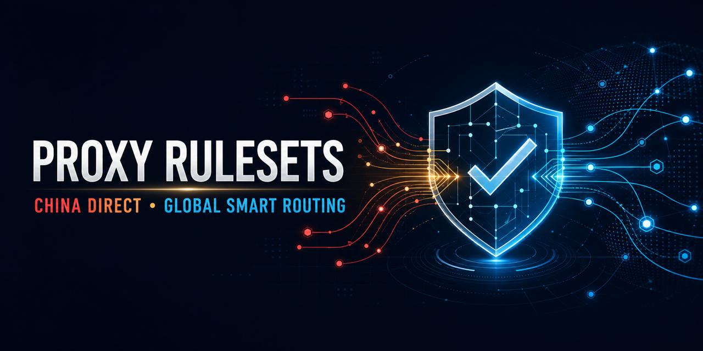

# Proxy Rulesets

<p align="center">
  
</p>

<p align="center">
  <a href="https://github.com/BrownieCoder/proxy-rulesets/actions/workflows/sync.yml"></a>
  <a href="LICENSE"></a>
  
  
  <a href="https://github.com/BrownieCoder/proxy-rulesets/stargazers"></a>
</p>

<p align="center"><strong>Audited mainland China game routing for Clash Meta / Mihomo—fast local DIRECT paths, protected international services, reproducible evidence.</strong></p>

[简体中文](README.md) | [English](README.en.md)

A self-maintained Clash/Mihomo ruleset mirror with an audited routing layer for mainland China gaming traffic.

The repository stores validated snapshots instead of relying only on upstream URLs. It also separates mainland game services from international game services so a proxy configuration can keep mainland traffic on `DIRECT` while sending international traffic to a US or other proxy node.

Built for users searching for reliable **Mihomo rule providers**, **Clash Meta rulesets**, **China DIRECT routing**, and low-latency mainland access for **WeGame, Delta Force, NetEase Games, miHoYo, Steam China, TapTap**, and other major Chinese game platforms.

## Highlights

- 24 mirrored and checksum-locked upstream rulesets
- 4 locally maintained rulesets, including `ChinaGaming` and `InternationalGaming`
- 93 high-priority mainland game rules
- 25 international-game safeguards
- Atomic synchronization: existing snapshots stay untouched unless every download validates
- Daily GitHub Actions updates
- Offline validation of files, checksums, provider references, duplicates, and routing priority
- A generic policy-group template covering every rule target without bundling nodes or subscriptions
- Evidence-backed audit covering Tencent/WeGame/Delta Force, NetEase, miHoYo, Perfect World, Seasun, Lilith, Nuverse, Kuro, Hypergryph, PaperGames, Bilibili Games, TapTap, 4399, and others

## Routing model

```text
security/reject rules
        ↓
known international games → 🎮 International Gaming (proxy exits only)
        ↓
mainland China games      → DIRECT
        ↓
other service rules
        ↓
known international media
        ↓
GEOIP CN                  → DIRECT
        ↓
ChinaMax / LAN / final
```

Mihomo uses first-match routing, so order is part of the design. Keep `InternationalGaming` before `ChinaGaming`, and keep both before broader providers such as Bilibili, Steam, GlobalMedia, and ChinaMax.

The exact host `fastcdn.hoyoverse.com` is intentionally set to `DIRECT` before the broader HoYoverse international rule because it is used by a mainland miHoYo page.

## Quick start

Use the remote provider template after publishing this repository:

1. Define nodes or `proxy-providers` in your private configuration. Never commit subscriptions, node addresses, or credentials to this repository.
2. Merge `proxy-groups` from [`config/proxy-groups.yaml`](config/proxy-groups.yaml).
3. Merge `rule-providers` from [`config/rule-providers.remote.yaml`](config/rule-providers.remote.yaml).
4. Merge the ordered rules from [`config/rules.yaml`](config/rules.yaml).
5. If you do not use this repository's policy-group template, replace every policy name with one defined in your configuration.
6. Run `mihomo -t -f your-config.yaml` before activating the configuration.

For a same-directory checkout, use [`config/rule-providers.local.yaml`](config/rule-providers.local.yaml).

## Policy-group design

[`config/proxy-groups.yaml`](config/proxy-groups.yaml) is a mergeable fragment, not a complete DNS, TUN, or node configuration. It uses Mihomo's `include-all` field to discover nodes and proxy-provider entries already defined by the user.

- `🎮 国际游戏` intentionally has no `DIRECT` option, preventing known international-game domains from falling back to the user's real exit.
- `ChinaGaming` remains fixed to `DIRECT` to preserve the low-latency mainland-routing contract.
- `♊ Gemini` can be routed independently, but its provider contains `apis.google.com` and broad keywords that may capture some non-Gemini Google traffic.
- `⚡ 自动选择` and `🇺🇸 美国节点` send health checks to `www.gstatic.com/generate_204`. Empty automatic groups fail closed to `REJECT` instead of silently using `DIRECT`.

## Mainland gaming safeguards

[`ruleset/ChinaGaming.yaml`](ruleset/ChinaGaming.yaml) prioritizes mainland game websites, authentication, launchers, updates, and verified CDN endpoints.

[`ruleset/InternationalGaming.yaml`](ruleset/InternationalGaming.yaml) protects international services that broad China lists may otherwise classify as domestic, including HoYoverse international domains and selected global publishing/SDK endpoints.

The configuration includes `GEOIP,CN,DIRECT,no-resolve` after GlobalMedia and before ChinaMax. This catches raw-IP/UDP mainland game servers without triggering additional DNS resolution or overriding known international-media rules.

Steam is intentionally narrower: verified mainland Steam/Valve download endpoints are in `ChinaGaming`, while the upstream `SteamCN` provider remains on the Steam policy because it also contains broad global suffixes such as `steamcontent.com`.

See the full audit in [English](research/ChinaGaming-audit.en.md) or [Chinese](research/ChinaGaming-audit.md).

## Repository layout

- `ruleset/` — committed ruleset snapshots
- `sources.json` — mirrored upstream URLs and destination paths
- `sources.lock.json` — synchronization metadata and SHA-256 checksums
- `local-rulesets.json` — locally maintained rulesets
- `config/proxy-groups.yaml` — policy-group template without private nodes
- `scripts/sync.py` — atomic downloader, normalizer, and provider generator
- `scripts/validate.py` — offline integrity and configuration validation
- `config/` — local and remote provider templates plus ordered example rules
- `research/` — fact-traceable routing audit
- `assets/` — repository artwork and the 1280×640 social preview

## Updating

```bash
python3 scripts/sync.py
python3 scripts/validate.py
python3 scripts/public_check.py
git diff --stat
```

The sync process downloads and validates every mirrored source before replacing any committed snapshot. A failure leaves the last known-good files intact.

GitHub Actions checks upstream sources daily and commits only material changes. Enable **Settings → Actions → General → Workflow permissions → Read and write permissions** after publishing.

## Accuracy and limitations

Routing data changes. Game clients may connect through raw IPs, shared cloud infrastructure, dynamic UDP endpoints, or hostnames delivered only at runtime. The rules cover verified public endpoints and include a mainland GeoIP fallback, but they cannot guarantee every game session or region.

For high-confidence additions, capture DNS/SNI/connection logs during a mainland client flow—cold start, login, update, and one match—and submit evidence with the proposed rule.

## Contributing

See [`CONTRIBUTING.md`](CONTRIBUTING.md). New rules should identify the mainland or international boundary, include authoritative evidence, and explain the risk of matching a shared root domain.

## License and third-party material

Project-authored code, documentation, and locally maintained rules are released under the [GNU General Public License v2.0](LICENSE).

Mirrored files remain attributable to their respective upstream authors and may carry additional notices or source-specific terms. Review [`THIRD_PARTY_NOTICES.md`](THIRD_PARTY_NOTICES.md) and `sources.json` before redistribution. This project is not affiliated with Mihomo, Clash, any game publisher, or any upstream ruleset project.

Provided without warranty. You are responsible for checking local law, upstream terms, and routing behavior before use.

## Credits

Some general-purpose rule snapshots originate from [blackmatrix7/ios_rule_script](https://github.com/blackmatrix7/ios_rule_script). Thanks to its authors and contributors. Source URLs, checksums, and license notices are recorded in [`sources.json`](sources.json), [`sources.lock.json`](sources.lock.json), and [`THIRD_PARTY_NOTICES.md`](THIRD_PARTY_NOTICES.md). This credit does not imply upstream endorsement.

If this project saves you latency or debugging time, consider starring it so more mainland/international dual-route users can find it.

## Siri / Apple Intelligence

The independent SiriAI provider contains five exact hosts, targets the existing AI group, and precedes Apple after ChinaGaming. Ordinary Siri/dictation on guzzoni.apple.com also follows that group. This is a narrow routing choice, not eligibility unlock or complete feature coverage. See the [Chinese audit and maintenance guide](research/SiriAI-maintenance.md). New remote URLs work only after separate publication; use local providers meanwhile.
